# 什么是 Lakebase？

### 背景

数据存储领域经历了三个时代：

**数据仓库 → 数据湖/湖仓（Lakehouse） → Lakebase**

简单打个比方：

* **数据仓库**：像一个精心整理的档案室，查询快但很死板，存什么格式都规定死了
* **数据湖（Lake）**：像一个大仓库，什么都往里扔，灵活但乱
* **湖仓（Lakehouse）**：把档案室和大仓库合并，既灵活又有结构，主要用于**分析**（看历史数据）
* **Lakebase**：在湖仓的基础上，再加一层**事务处理引擎**（OLTP），让你可以同时做实时读写 + 历史分析 + AI 推理，全部在一个平台上搞定

<figure><figcaption></figcaption></figure>

### 理解三个关键层

1. **OLTP 事务层**：就是一个速度极快的"操作数据库"，你可以秒级地增删改查，比如记录用户的最新操作状态、存 AI 对话历史。不需要单独的向量数据库，所有东西都跑在同一个实例里。
2. **向量搜索层**：AI 不懂"关键词匹配"，它懂"语义相似"。比如用户搜索"干性皮肤保湿霜"，系统能找到"补水面霜"——文字不同但含义相近。 向量数据库这一层把文字、图片转成数字向量，然后快速找相似内容，是 RAG（检索增强生成）的核心。
3. **Lakehouse 分析层**：存储海量历史数据，用开放格式（Parquet）保存，跑大规模离线分析。Synced Tables（同步表）功能可以把事务数据近实时地同步到这里。

### Lakebase 到底解决了什么痛点？

以前的架构要这样：

_业务数据库 → ETL 管道 → 数据仓库 → 另一套 ETL → 向量数据库 → 再对接 AI_

这条链路又慢、又贵、又容易出错。传统 OLTP 数据库从未被设计来满足 AI 应用对速度和灵活性的需求，它们独立于分析框架之外，造成瓶颈并需要手动数据整合。 [Perficient Blogs](https://blogs.perficient.com/2025/06/22/introduction-to-databricks-lakebase-for-ai-driven-applications/)

Lakebase 把这一切压缩成一个平台：通过"同步表"功能，自动同步操作数据和历史湖仓数据，无需构建和管理复杂的 ETL 管道。

<figure><figcaption></figcaption></figure>

### 总结

**Lakebase = PostgreSQL 数据库 + 向量搜索 + 数据湖分析，三合一，专为 AI 时代设计。**

> Databricks 在 2025 年 5 月以 10 亿美元收购了 Neon（一家云端 PostgreSQL 公司），将其能力重新整合后推出了 Lakebase，并于 2026 年 2 月正式在 AWS 上发布。

几个值得关注的特点：

* 计算与存储分离，不再像传统 PostgreSQL 那样竞争内存资源，还支持自动扩缩容，甚至可以缩到零（不用就不收费）。
* 支持"数据库分支"，能快速克隆生产数据库做测试，不影响真实数据。
* AI Agent 可以自己按需创建数据库，作为 AI 处理流程中的临时中间步骤。

