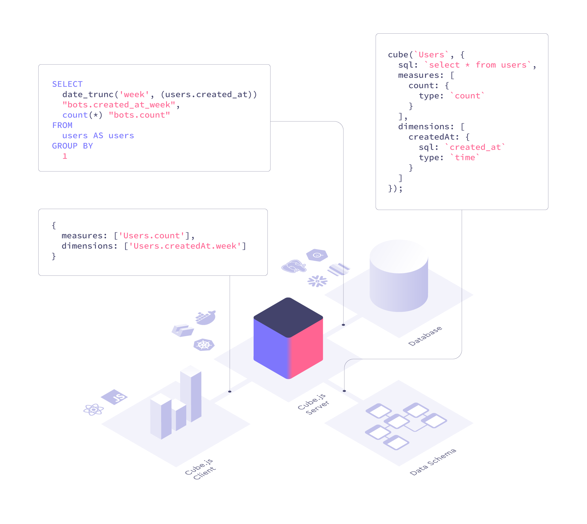

# 10.水晶球数据洞察取数逻辑优化

**一.背景介绍**

水晶球作为一款数据产品的一个主要场景就是对指标数据的可视化展示，而其中对指标数据的查询始终没有统一的标准，这导致在做类似的产品的模块时会做很多重复工作，严重影响开发的效率和后期的维护工作。针对这一问题，我们一直在寻找一种通用的取数逻辑。

**二.传统取数逻辑**

早起数据洞察使用 Restful API 的形式进行取数，根据页面的工作模块进行抽象，API 与模块是强绑定的关系。

到了 RTM 数据洞察时，发现上述方式的弊端，决定尝试新的方式。我们将一类图表与一段 SQL 模板进行配置关联，将数据查询由单一模块扩展到一类的数据展示，而且是基于配置的开发，开发效率和复用性都有一定的提高。

但是 SQL 模版的方式还是不够灵活，当涉及到业务更加多变时，需要维护大量的 SQL 模版。

至于后端为什么不采用 GraphQL 实现，我这里已经不得而知了

**三.挑战和需求**

* 后端人员不足，支持不了业务 API 的开发
* 是否存在一种工具将 JSON 对象的配置转化为 SQL 语句

**四.取数逻辑演进方向**

我们期望的结果是，前端通过 JSON 格式的对象，需要有一个服务将 JSON 解析为 SQL 语句，然后进行数据查询，之后将数据已统一的格式返回。前端根据返回的数据进行处理，以不同的形式呈现。

*   [**Cube.js**](https://cube.dev/)

    > Cube通过REST、GraphQL或SQL接口接受查询。根据数据模型和传入的查询，Cube生成一个SQL查询并在您的数据库中执行它。Cube完全管理查询编排、数据库连接以及缓存和访问控制层。然后将结果发送回客户端。

<figure><figcaption></figcaption></figure>

<figure><figcaption></figcaption></figure>

Cube.js 满足我们的期望，但使用这种第三方的开源平台时，我期望的是按照他们的标准来实现我们的业务。但事与愿违，由于我们自身的遗留问题以及业务的限制，以及 clickhouse 版本的问题，不得不弃用 Cube。（魔改的成本过高）

*   DataLegoGq

    DataLegoGq 是内部研发的一个功能类似 Cube 的服务，起初也是不能满足我们所有的需求，

    但由于整体服务都是自研，新增功能更加可控。

**五.总结**

* **优化后取数逻辑对业务发展的意义**
  * 可以去掉业务后端的服务层，减少链路
  * 取数逻辑统一，方便后续可视化组件的沉淀
  * 可以逐步替换原有后端的服务，释放机器，减少成本
* **面临的挑战和需要解决的问题**
  * 大数据量下，取数时间与数据准确性之间的矛盾
  * 数据本身的问题，空字符串、unknown、null 等脏数据的问题
  * 指标的配置前端后端目前都要维护，后端用于生成 SQL，前端用于 UI 呈现，希望后面进行统一
  * 前端要查哪些指标，指标有哪些维度，目前还没有统一的位置查看，还是要询问开发者
  * 新增指标流程繁琐
