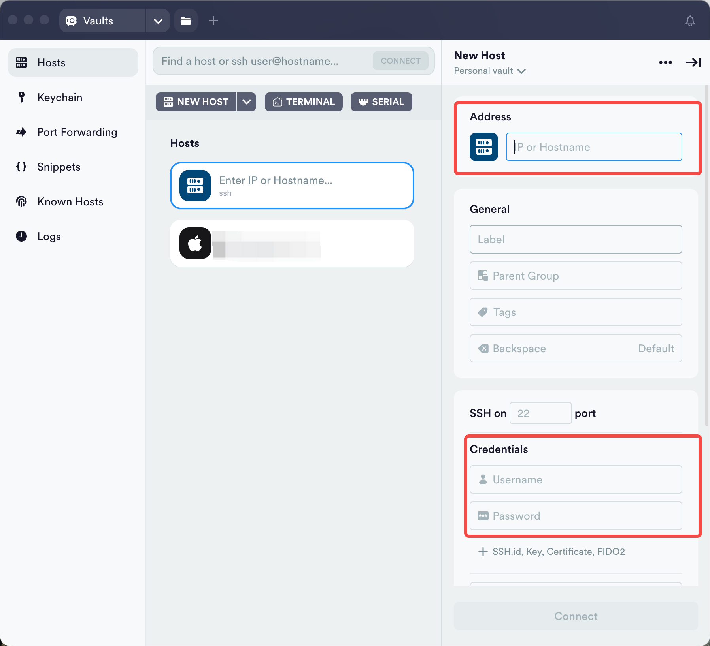
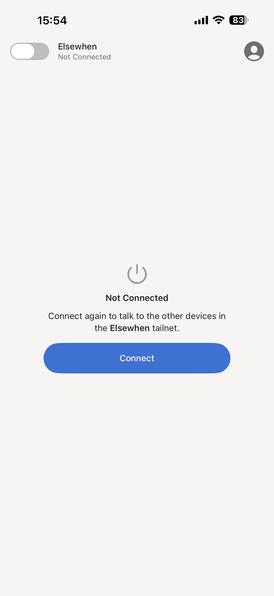
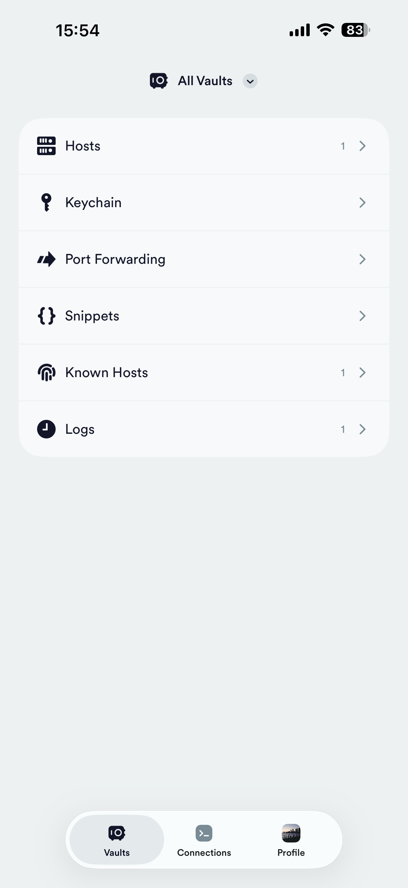

# 14.Remote Problem-Solving Workflow with Tailscale + Termius + tmux + Claude Code

### Overview

This guide introduces a powerful remote development and problem-solving workflow that enables you to connect to development servers from your phone anytime, anywhere, leveraging AI assistance for code debugging and issue resolution. This solution is particularly suitable for emergency production fixes or development work in mobile scenarios.

### Technology Stack

* **Tailscale**: Zero-config VPN solution providing secure peer-to-peer connections
* **Termius**: Mobile SSH client supporting iOS and Android
* **tmux**: Terminal multiplexer for persistent sessions
* **Claude Code**: AI-powered command-line coding assistant

### How It Works

```
Phone (Termius) 
    ↓ (via Tailscale VPN)
Remote Server (tmux session)
    ↓ (running)
Claude Code (AI coding assistant)
```

### Detailed Setup Guide

#### 1. Configure Tailscale

**Install Tailscale on Mac**

```bash
# Ubuntu/Debian
curl -fsSL https://tailscale.com/install.sh | sh

# macOS
brew install tailscale

# Start and authenticate
sudo tailscale up
```

**Install Tailscale on Mobile**

1. Download Tailscale from App Store (iOS) or Google Play (Android)
2. Log in with the same account
3. Ensure both server and phone appear in the same Tailnet

**Get Mac's Tailscale IP**

```bash
tailscale ip -4
# Output: 100.x.x.x
```

#### 2. Configure Termius

**Install Terminus**

[https://termius.com/index.html](https://termius.com/index.html)

**Connect Your Mac**

Prerequisites：Enable "Remote Login".

<figure><figcaption></figcaption></figure>

**Address**: use Tailscale IP

**Username**: your mac username

**Password**: your mac password

#### 3. Configure tmux

**Install tmux**

```bash
# Ubuntu/Debian
sudo apt install tmux

# macOS
brew install tmux

# CentOS/RHEL
sudo yum install tmux
```

**Essential tmux Commands**

```bash
# Create named session
tmux new -s <name|index>

# List all sessions
tmux ls

# Attach to session
tmux attach -t <name|index>

# Detach session
tmux detach

# kill sesstion
tmux kill-session -t <name|index>

# switch sesion
tmux switch -t <name|index>

# rename session
tmux rename-session -t <name|index> <new-name>
```

#### 4. Real-World Use Cases

* Open Tailscale app on your phone and Click **Connect**

<p align="center"></p>

* Open Termius app and choose target Host

<p align="center"></p>

* Attach to target terminal session

<p align="center"></p>

* Chat with claude code

<p align="center"></p>

### Resources

* [Tailscale Documentation](https://tailscale.com/kb/)
* [Termius Official Site](https://termius.com/)
* [tmux Cheat Sheet](https://tmuxcheatsheet.com/)
* [Claude Code Documentation](https://docs.claude.com/)
* [SSH Best Practices](https://infosec.mozilla.org/guidelines/openssh)
